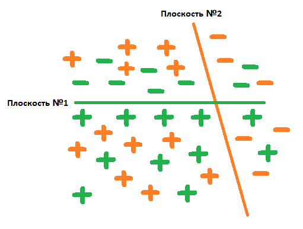
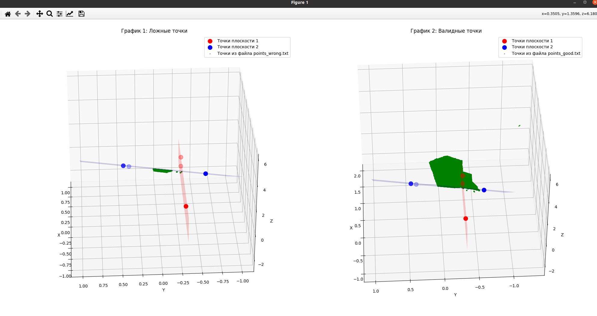

# Решение тестового задания
## Основной ход решения:
1. Считать координаты точек 2-х плоскостей
2. Построить уравнения плоскостей
3. Считывать координаты точек, определяя на основании знака результата подстановки их координат в уравнение плоскости, "хорошие" они или "плохие". На рисунке №1 область внутри робота показана "+" обеих цветов (плоскостей), соответственно, эта область "плохих" точек, их мы исключаем.
---

---
"Плохие" и "хорошие" точки показаны на рисунке №2.
---

---
## Инструкция по запуску программы:
1. Создать папку build, если она еще не создана:
```mkdir -p build```
2. Перейти в папку и сгенерировать make-файл:
```cd build && cmake ..```
3. Собрать программу:
```make```
4. Запустить программу, указав пути до файлов с координатами точек и плоскостей:
```./test_task ../points.txt ../planes.txt```
5. Установить зависимости для программы на Python командой ```pip install -r requirements.txt```

6. Далее перейти в корневую директорию проекта командой ```cd ..``` и запустить файл visualize.py
